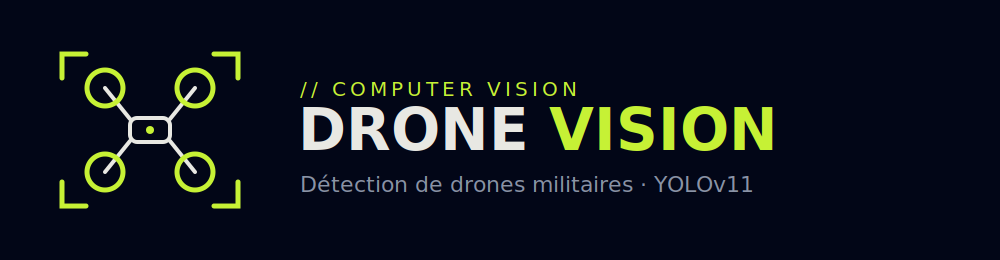

<p align="center">
  
</p>

<p align="center">
  
  
  
  
  
  
  
</p>

<p align="center">
  🌐 <a href="https://pamalick00-detection-drones.static.hf.space"><b>Démo live (détection dans le navigateur)</b></a>
</p>

# Projet : Détection de drones militaires avec YOLOv11

Computer Vision - Détection de drones militaires dans des images, réalisée de bout en bout : collecte, annotation, entraînement, évaluation, démonstration.

Résultats sur le jeu de test : Precision 0.927, Recall 0.875, mAP@50 0.884, mAP@50-95 0.546.

## Le dossier

- `Rapport_Detection_Drones_YOLOv11.docx` : le rapport, avec la liste complète des sources en annexe.
- `Detection_Drones_YOLOv11.ipynb` : le notebook Colab (entraînement, évaluation, démonstration).
- `dataset.zip` : le jeu de données prêt pour l'entraînement, à importer dans Colab.
- `split_audit.csv` : d'où vient chaque image et dans quel sous-ensemble elle se trouve.
- `modele/` : le modèle entraîné (best.pt et best.onnx).
- `annotations/` : l'export Roboflow, au format YOLO.
- `donnees/` : les images (propres, brutes, frames, vidéos, négatives, démo).
- `scripts/` : préparation des images, extraction des frames, découpage du dataset.

## Refaire l'entraînement

```
python scripts/decouper_dataset.py
```

Puis ouvrir le notebook sur Colab, activer le GPU T4, importer `dataset.zip` dans la session et exécuter les cellules dans l'ordre.

## Les deux problèmes rencontrés

**Fuite de données.** Le découpage aléatoire de Roboflow mettait dans le jeu de test des frames vidéo quasi identiques à des frames d'entraînement, à une ou deux secondes d'écart. Les scores étaient donc faussés : un mAP@50 annoncé à 0.976. Après un découpage qui garde chaque vidéo dans un seul sous-ensemble, le vrai chiffre tombe à 0.860.

**Fausses détections.** Le jeu annoté ne contient aucune image sans drone. Le modèle encadrait donc un navire, une salle de contrôle, des murs de hangar. J'ai ajouté 10 images négatives, ce qui fait remonter toutes les métriques à leur niveau final.

## Configuration retenue

YOLOv11s pré-entraîné sur COCO. SGD, learning rate 0.005 avec warmup, gel du backbone (freeze=10), 120 époques avec patience 40, augmentation géométrique allégée (mosaic 0.5, mixup 0, pas de rotation).

## Démo interactive

Le dossier `site/` contient une vitrine web (Vue 3 + Vite) dont la démo fait tourner
le modèle **entièrement dans le navigateur** via ONNX Runtime Web — aucun serveur.
Déployée gratuitement en Static Space :
👉 **https://pamalick00-detection-drones.static.hf.space**

---

## 👤 Auteur

**Papa Malick NDIAYE** - Étudiant en Master 2 Data Science &amp; Génie Logiciel
(Université Alioune Diop de Bambey, Sénégal). Computer Vision, Deep Learning et
déploiement de modèles en production.

<p>
  <a href="https://github.com/pa-malick"></a>
  <a href="mailto:njaymika@gmail.com"></a>
  <a href="https://www.linkedin.com/in/papa-malick-ndiaye-b58b22309"></a>
</p>
